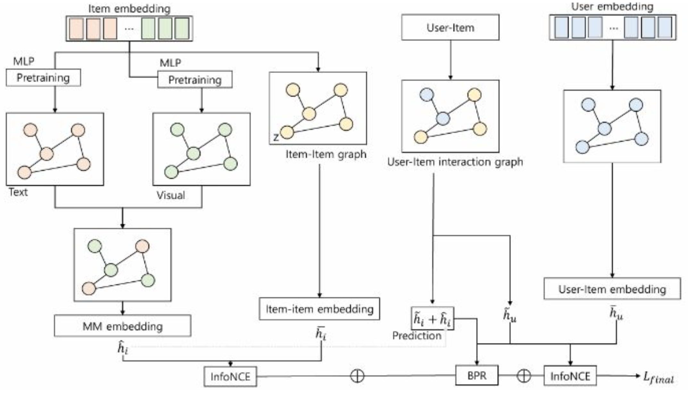

<div align="center">

# Relational Alignment Graph Neural Network for Multimodal Recommendation

**[Woo-Seong Yun](https://github.com/yunwooseong)** &nbsp;·&nbsp; **Myung-Bin Gwak** &nbsp;·&nbsp; **Eun-Sun Kim** &nbsp;·&nbsp; **Yoon-Sik Cho**

<sub>Department of Artificial Intelligence, Chung-Ang University</sub>

*IEIE Summer Conference (The Institute of Electronics and Information Engineers), pp. 4929–4933, Jun. 2025*

[](https://www.dbpia.co.kr/journal/articleDetail?nodeId=NODE12332645)
[](https://www.python.org/)
[](https://pytorch.org/)
[](LICENSE)
[](https://www.dbpia.co.kr/journal/articleDetail?nodeId=NODE12332645)

</div>

This is the PyTorch implementation for our RADIAN paper:

> Relational Alignment Graph Neural Network for Multimodal Recommendation (IEIE Summer Conference, 2025)

<p align="center">
  
</p>

## Overview

Existing multimodal recommenders inject pre-trained image and text features into the item graph as-is, treating them as ground truth about the item. They are not: pre-trained features encode background, brightness and textual noise that have nothing to do with why users interact, and no existing model asks whether the multimodal signal actually agrees with observed behavior. They also model users only through the items they consumed, leaving user-to-user relations implicit. **RADIAN** (Relational Alignment and Denoising for Multimodal Recommendation) takes a different stance: *behavior should supervise modality, not the other way around.* From the interaction matrix alone we derive two homophily graphs, item–item and user–user, using degree-normalized co-occurrence so that popular nodes do not dominate. The item–item graph serves as a behavior-grounded anchor: contrasting its embedding against the multimodal item embedding with InfoNCE pulls the multimodal representation toward what users actually care about and pushes away preference-irrelevant noise. The user–user graph, contrasted against the user ID embedding, makes preferences shared among similar users explicit rather than leaving them buried in item co-consumption. Both graphs are cheap to build, require no extra data, and plug into a standard LightGCN backbone. On Amazon Baby, Sports and Clothing, RADIAN improves over the strongest multimodal baseline by 10.6–18.4% in Recall@20 and 11.7–17.9% in NDCG@20, and the ablation confirms that each graph contributes and that contrastive alignment, not mere feature addition, drives the gain.

## Requirements

```bash
conda env create -f src/env.yaml
conda activate MMRec
```

## Datasets

We use three Amazon review datasets (5-core) with 4096-d visual features from VGG16 and 384-d text features from Sentence-Transformers. Interactions are split randomly into train / validation / test at 8:1:1.

| Dataset | Users | Items | Interactions | Sparsity |
| --- | ---: | ---: | ---: | ---: |
| Baby | 19,445 | 7,050 | 160,792 | 99.88% |
| Sports | 35,598 | 18,357 | 296,337 | 99.95% |
| Clothing | 39,387 | 23,033 | 278,677 | 99.97% |

Download the preprocessed data from [Google Drive](https://drive.google.com/drive/folders/13cBy1EA_saTUuXxVllKgtfci2A09jyaG?usp=sharing) and place each dataset folder under `data/`. Scripts for preprocessing from raw Amazon data are provided in `preprocessing/`.

## Training

```bash
cd src
python main.py --dataset baby --model RADIAN
python main.py --dataset sports --model RADIAN
python main.py --dataset clothing --model RADIAN
```

## Results

Bold marks the best result and underline the second best (Table 2 of the paper).

| Model | Baby<br>Recall@20 | Baby<br>NDCG@20 | Sports<br>Recall@20 | Sports<br>NDCG@20 | Clothing<br>Recall@20 | Clothing<br>NDCG@20 |
| --- | ---: | ---: | ---: | ---: | ---: | ---: |
| MF | 0.0440 | 0.0200 | 0.0430 | 0.0202 | 0.0191 | 0.0088 |
| NGCF | 0.0591 | 0.0261 | 0.0695 | 0.0318 | 0.0387 | 0.0168 |
| LightGCN | 0.0698 | 0.0319 | 0.0782 | 0.0369 | 0.0470 | 0.0215 |
| VBPR | 0.0486 | 0.0213 | 0.0582 | 0.0265 | 0.0481 | 0.0205 |
| MMGCN | 0.0640 | 0.0284 | 0.0638 | 0.0279 | 0.0501 | 0.0221 |
| GRCN | 0.0754 | 0.0336 | 0.0833 | 0.0377 | 0.0631 | 0.0276 |
| LATTICE | <u>0.0829</u> | <u>0.0368</u> | <u>0.0915</u> | <u>0.0424</u> | <u>0.0710</u> | <u>0.0316</u> |
| **RADIAN** | **0.0917** | **0.0411** | **0.1083** | **0.0500** | **0.0795** | **0.0364** |
| *Improv.* | *10.62%* | *11.68%* | *18.36%* | *17.92%* | *11.97%* | *15.19%* |

## Citation

If you find this work useful, please cite:

```bibtex
@inproceedings{yun2025radian,
  title     = {Relational Alignment Graph Neural Network for Multimodal Recommendation},
  author    = {Woo-Seong Yun and Myung-Bin Gwak and Eun-Sun Kim and Yoon-Sik Cho},
  booktitle = {Proceedings of the IEIE Summer Conference},
  pages     = {4929--4933},
  year      = {2025},
  month     = jun,
  publisher = {The Institute of Electronics and Information Engineers}
}
```

## Acknowledgements

This research was supported by the MSIT (Ministry of Science and ICT), Korea, under the ITRC (Information Technology Research Center) support program (IITP-2024-RS-2024-00438056) supervised by the IITP (Institute for Information & Communications Technology Planning & Evaluation); by the National Research Foundation of Korea (NRF) grant funded by the Korea government (MSIT) (No. RS-2024-00419201); and by the IITP grant funded by the Korea government (MSIT) (RS-2021-II211341, Artificial Intelligence Graduate School Program (Chung-Ang University)).

Our implementation builds on [MMRec](https://github.com/enoche/MMRec), [LATTICE](https://github.com/CRIPAC-DIG/LATTICE) and [UltraGCN](https://github.com/reczoo/UltraGCN).
